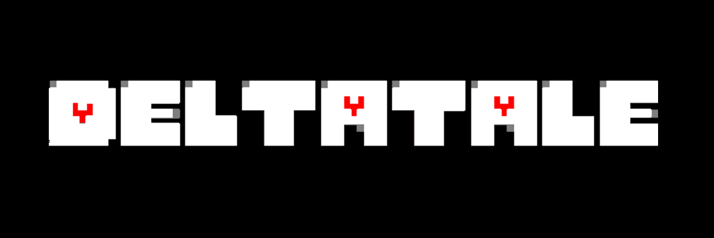

  

# Deltatale

Welcome to **Deltatale**, an Undertale and Deltarune crossover fan-game where Kris and Susie find themselves in the Underground.

> **IMPORTANT NOTE:**
> This project is currently in **pre-alpha**. The game is in active development, and I do not yet advise trying to play it for a full, polished experience. Expect bugs, placeholder assets, and incomplete features.

---

## 📖 About The Game

What happens when the chaotic energy of Deltarune's Lightners crashes into the carefully orchestrated world of Undertale? **Deltatale** explores this exact scenario. 

Take control of Kris and Susie as they navigate the Ruins, encounter familiar faces, and completely derail the original story. Whether they decide to spare the monsters they meet or destroy everything in their path is entirely up to you.

---

## ✨ Features

*   **A New Perspective:** Experience the classic Undertale Underground through the eyes of Kris and Susie.
*   **Original Dialogue:** Brand new, character-accurate interactions (yes, Susie will absolutely bully Flowey).
*   **Multiple Routes:** Your choices matter. Play peacefully or watch your decisions lead down a darker path.

---

## 🎮 Controls

| Action | Keyboard |
| :--- | :--- |
| **Move** | Arrow Keys |
| **Interact / Confirm** | Z or ENTER |
| **Cancel / Run** | X or SHIFT |
| **Menu** | C or CTRL |

---

## 🛠️ Installation

> **NOTE:**
> I have not yet packaged the project into an executable. If you are a developer and want to check the project out for yourself, feel free to do so!

---

## ⚖️ Disclaimer

**Deltatale** is a fan-made project and is not affiliated with, endorsed by, or connected to Toby Fox. All original characters, music, and lore belong to their respective creator. 

If you haven't played the original games, please support Toby Fox by checking out **Undertale** and **Deltarune** first!